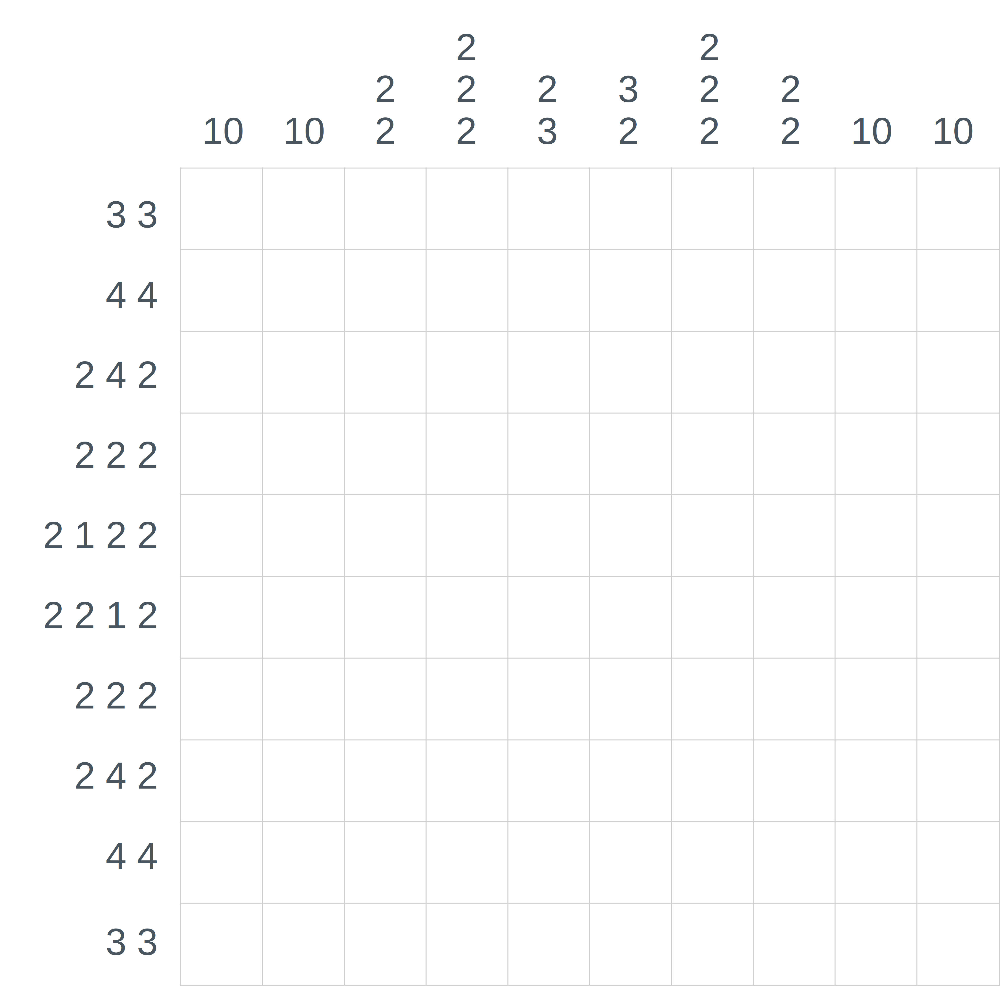
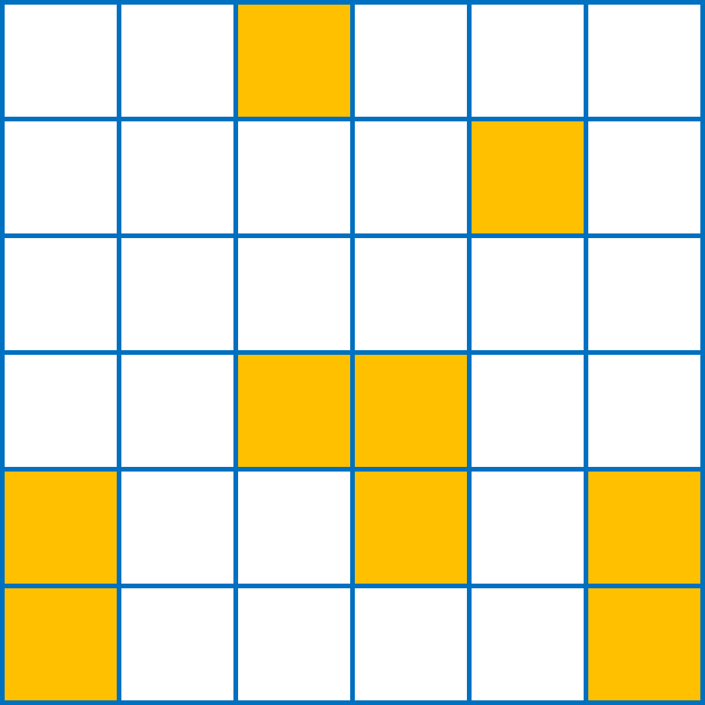
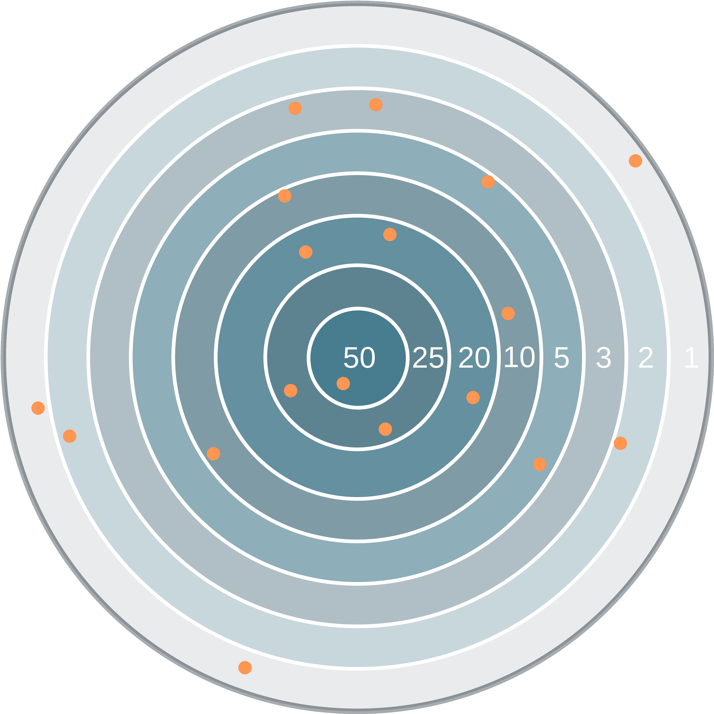
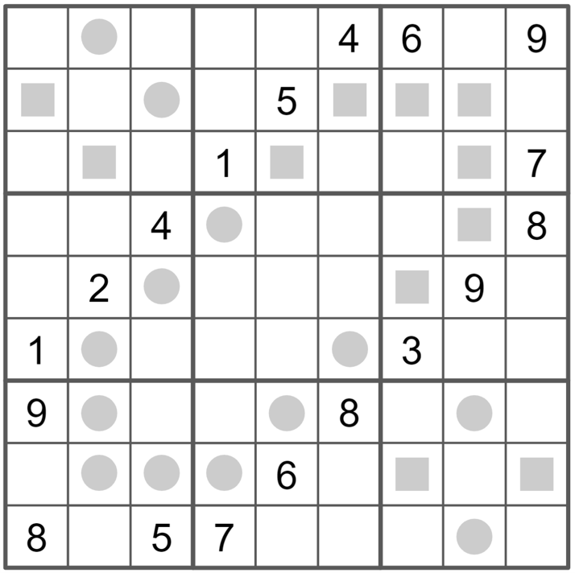

# Mip Wise Fun Puzzles
This repository contains solutions to the collection
of puzzles proposed to the Mip Wise community.

Go to https://www.mipwise.com/puzzles to see the statements
of all puzzles.

The answer and proposed analytics solutions to each puzzle are
maintained in the directory that has the name of the respective
puzzle.

## Nonogram
_Aug 2021_  
This is the [Nonogram Puzzle](https://en.wikipedia.org/wiki/Nonogram) 
(also known as *Crucipixel*, *Paint by Numbers*, *Griddlers*, and other names).
The objective is to paint cells to form horizontal and vertical strings. 
The length of each horizontal string is prescribed by the number on the left.
The length of each vertical string is prescribed by the number on the top.
For example, the second row must have two strings of filled cells, the first with length 3 
and the second one with length 1 (the order must be preserved). 
Finally, there must be at least one empty cell between any two horizontal/vertical consecutive strings. 

_Source_: Book [Integer Programming](https://link.springer.com/book/10.1007/978-3-319-11008-0), by
Michele Conforti, Gérard Cornuéjols, and Giacomo Zambelli.  
[Solution](nonogram)

## Continuous Line
*Jul 2021*  
Draw a continuous line that visits every empty cell of the grid exactly once. 
The line can start in any empty cell, but it can only move to a horizontal or vertical 
adjacent cell (diagonal moves are not allowed). 
The line must not visit any of the colored cells.  
  

*Source: Mip Master team.*  
[Solution](continuous_line)

## Darts
*Jul 2021*  
Andrea, Antônio, and Luiz were playing darts. They each threw 6 darts (red marks), 
and each scored 71 points. Andrea’s first 2 darts scored 22 points. 
Antônio’s first dart scored 3 points. Who hit the bullseye?
  

*Source: Adapted from [The Opex Analytics Weekly Puzzle](
https://www.amazon.com/Opex-Analytics-Weekly-Puzzle-Probability/dp/1731343647) book, Volume II.*  
[Solution](darts)

## Even/Odd Sudoku
*Jun 2021*  
Same rules of the standard sudoku, i.e., the digits 1 through 9 into the grid so that no digit repeats 
in any row, column, or bold region. In addition, cells with a square must contain an even digit 
and cells with a circle must contain an odd digit.  

*Source: [The Art of Puzzles](https://www.gmpuzzles.com/blog/2021/03/even-odd-sudoku-by-swaroop-guggilam/).*  
[Solution](even_odd_sudoku)

